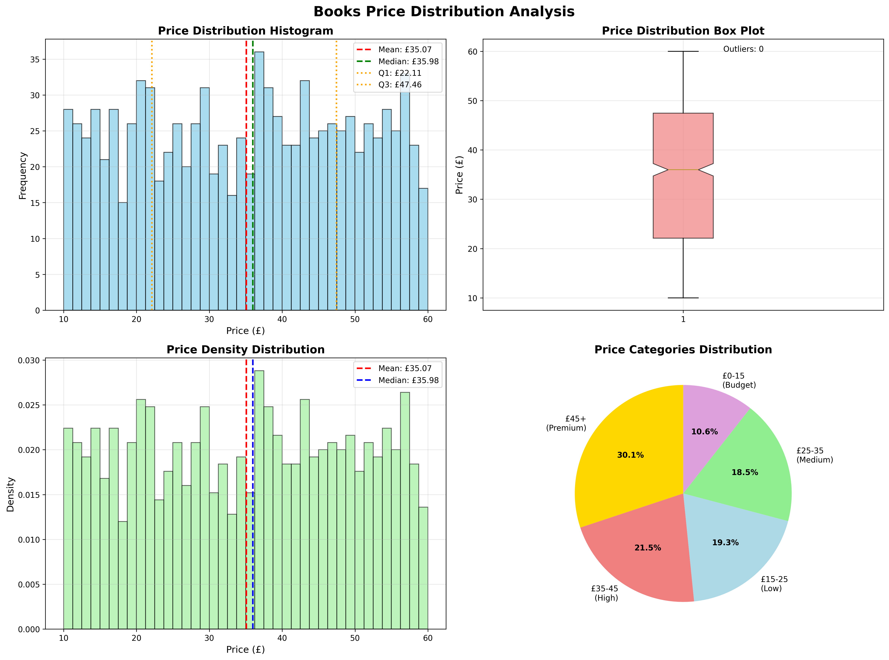
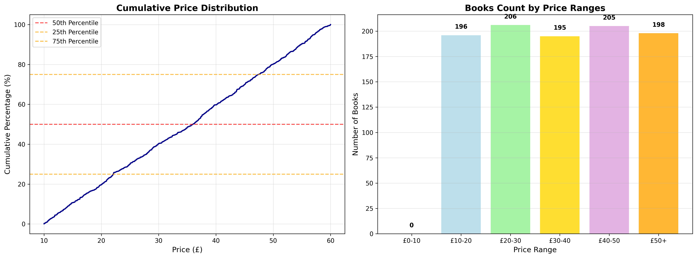
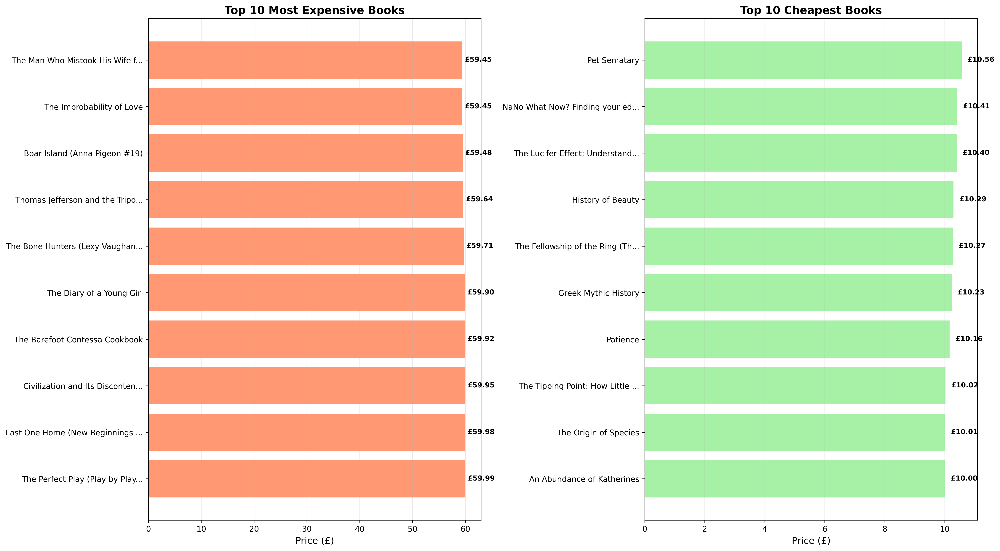
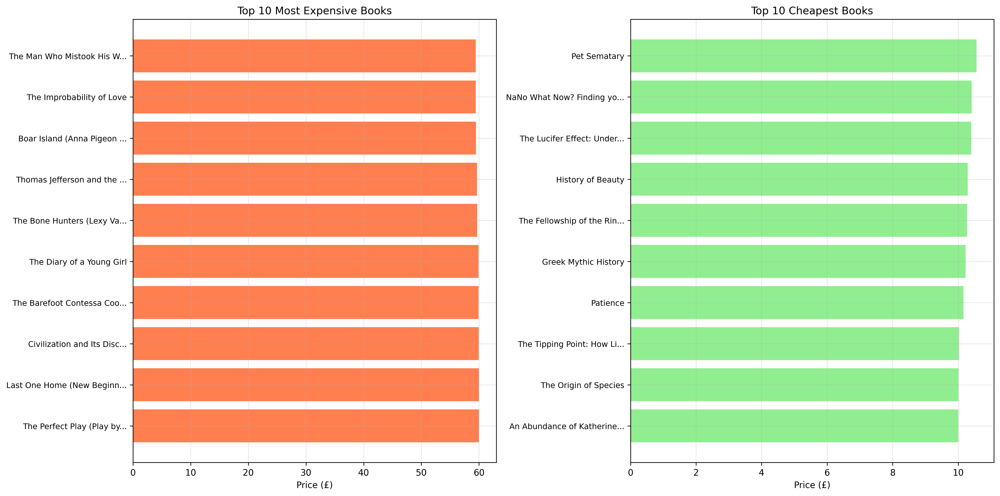
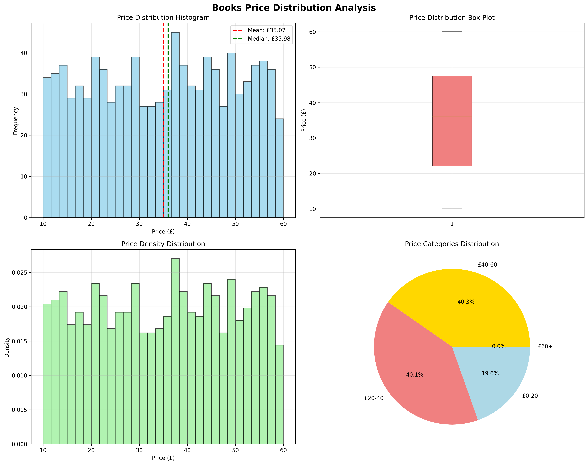

# Book Website Web Scraping

A comprehensive Python project for scraping, analyzing, and visualizing book price data from [books.toscrape.com](https://books.toscrape.com/). This repository includes modular web scraping scripts, data cleaning and EDA notebooks, and an interactive Streamlit dashboard for data exploration.

---

## Table of Contents

- [Overview](#overview)
- [Features](#features)
- [Project Structure](#project-structure)
- [How It Works](#how-it-works)
- [Getting Started](#getting-started)
- [Visualizations](#visualizations)
- [Data Dictionary](#data-dictionary)
- [Acknowledgements](#acknowledgements)

---

## Overview

This project scrapes 1,000 books from 50 pages of books.toscrape.com. The data is analyzed and visualized to uncover pricing patterns, distributions, and insights about book prices.

**Key Goals:**
- Automate data extraction from a real e-commerce sample site.
- Perform EDA and price statistics.
- Visualize distributions and identify outliers.
- Provide an interactive dashboard for exploration.

---

## Features

- **Automated Web Scraping**: Robust Python scripts to fetch book data (title, price, details) from multiple pages.
- **Data Cleaning & EDA**: Jupyter Notebook to clean, process, and analyze scraped data.
- **Rich Visualizations**: Price distributions, box plots, price categories, and top/bottom book lists.
- **Streamlit Dashboard**: Interactive web app to explore statistics and insights.

---

## Project Structure

```
.
├── Books_EDA_Analysis.ipynb      # Exploratory Data Analysis notebook
├── all_books_50_pages.csv        # Final scraped dataset (1,000 books, 50 pages)
├── fetcher.py                    # Fetches HTML content from the website
├── parser.py                     # Parses book info from HTML
├── saver.py                      # Saves and loads CSV data
├── main.py                       # Orchestrates scraping workflow
├── streamlit_app.py              # Streamlit dashboard for data visualization
├── price_distribution_analysis.png      # Price distribution visualization
├── additional_price_analysis.png        # Additional price insights
├── price_analysis.png                   # Price statistics plot
├── top_books_analysis.png               # Top priced books plot
├── top_bottom_books_analysis.png        # Top & bottom books side-by-side plot
└── ...
```

*Note: Only a subset of files is shown here. See the [GitHub repo](https://github.com/MariamGhanim/Book-Website-Web-Scrapping/tree/main/) for all files.*

---

## How It Works

1. **Web Scraping (`main.py`, `fetcher.py`, `parser.py`, `saver.py`):**
   - Fetches book list pages and details using Python's `requests` and BeautifulSoup.
   - Extracts book title, price, and other attributes.
   - Cleans and saves data as `all_books_50_pages.csv`.

2. **Exploratory Data Analysis (`Books_EDA_Analysis.ipynb`):**
   - Reads the CSV dataset.
   - Cleans price columns, computes statistics (mean, median, IQR, outliers).
   - Produces summary tables and plots.

3. **Visualization & Dashboard (`streamlit_app.py`):**
   - Loads the dataset and offers interactive filtering.
   - Displays histograms, boxplots, pie charts, and bar charts.
   - Allows users to explore price segments and download filtered data.

---

## Getting Started

### 1. Clone the Repository

```bash
git clone https://github.com/MariamGhanim/Book-Website-Web-Scrapping.git
cd Book-Website-Web-Scrapping
```

### 2. Install Requirements

```bash
pip install -r requirements.txt
# If requirements.txt does not exist, install manually:
pip install requests beautifulsoup4 pandas numpy matplotlib seaborn streamlit plotly
```

### 3. Run the Scraper

```bash
python main.py
```
Follow the prompts to scrape the dataset.

### 4. Launch the Dashboard

```bash
streamlit run streamlit_app.py
```
Open the provided local URL in your browser to access the dashboard.

---

## Visualizations

- **Price Distribution**  
  

- **Additional Price Analysis**  
  

- **Top & Bottom Books**  
  

- **Top Books**  
  

- **Price Analysis**  
  

---

## Data Dictionary

| Column         | Description                       |
|----------------|-----------------------------------|
| Title          | Book title                        |
| Price          | Price as scraped (e.g., £35.07)   |
| Price_Numeric  | Cleaned numeric price (float)     |
| Scraped_At     | Datetime the data was scraped     |

---

## Acknowledgements

- Data from [books.toscrape.com](https://books.toscrape.com/), a demo site for web scraping practice.
- Inspired by the need for hands-on data science and visualization projects.

---

## License

This project is for learning and demonstration purposes. See [LICENSE](LICENSE) for more details.

---

*Note: The file and image listings above are based on a partial view of the repository. For the most up-to-date and complete file list, see the [GitHub repo](https://github.com/MariamGhanim/Book-Website-Web-Scrapping/tree/main/).*
